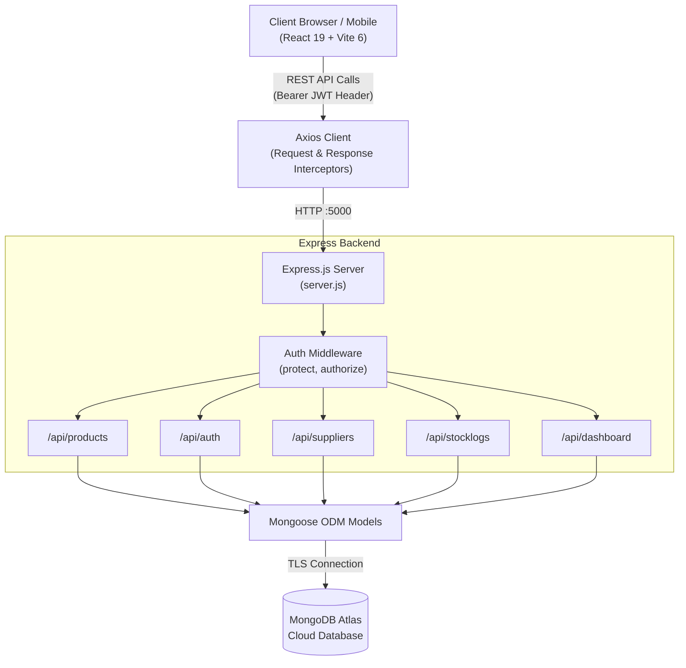

# SmartStock — Real-Time Inventory & Warehouse Management System


> **Academic Project**: Silver Oak University — BCA (Honours) Full Stack Development - I (3040233448)  
> **Repository**: [github.com/alexchrisdev-11/smartstock](https://github.com/alexchrisdev-11/smartstock)

---

## 1. Problem Statement & Value Proposition

Traditional warehouse and supply operations rely on fragmented spreadsheets and manual paper logs, resulting in:
- **Inventory Discrepancies**: Inaccurate counts leading to unexpected out-of-stock events.
- **Lost Update Anomalies**: Concurrent sales or barcode scans overwriting quantity records.
- **Audit Deficits**: No verifiable historical tracking of who adjusted stock, when, or why.
- **Security Risks**: Unrestricted deletion or modification of critical product records.

**SmartStock solves this** through a centralized, reactive Single Page Application backed by an authoritative Express REST API and MongoDB. It enforces **server-side atomic stock increments and decrements**, prevents negative inventory balances, logs every transaction to an **immutable audit trail**, and secures sensitive operations using **Role-Based Access Control (RBAC)**.

---

## 2. System Architecture



---

## 3. Core Features

* **Real-Time Catalog Management**: Browse products with unit pricing, categorized grouping, and status badges (`IN STOCK` vs `LOW STOCK`).
* **Instant In-Memory Search**: Reactive filtering across product name, SKU, and category without extra network roundtrips.
* **Atomic Stock Adjustments**: Instant single-click `+` / `−` quantity adjustments executed server-side to eliminate race conditions.
* **Immutable Audit Ledger**: Every inventory adjustment creates an uneditable `StockLog` recording product, delta quantity, user ID, and timestamp.
* **Role-Based Access Control (RBAC)**:
  * **Staff**: View catalog, search items, and execute stock adjustments.
  * **Admin**: All Staff capabilities + exclusive permission to delete products, manage suppliers, and view raw audit user mappings.
* **Live KPI Dashboard**: Real-time aggregation of total catalog products, total monetary valuation (`sum(price * quantity)`), low-stock alert counters, and a 10-event live activity feed.
* **Supplier Directory**: Full vendor procurement directory with email, phone, and facility address management.

---

## 4. API Contract Quick-Reference (18 Endpoints)

| Domain | Method | Endpoint | Access / Role | Description |
| :--- | :---: | :--- | :---: | :--- |
| **Auth** | `POST` | `/api/auth/register` | Public | Register new staff or admin user account |
| **Auth** | `POST` | `/api/auth/login` | Public | Authenticate credentials and receive signed JWT |
| **Auth** | `GET` | `/api/auth/me` | Protected | Retrieve currently authenticated user profile |
| **Products** | `GET` | `/api/products` | Public | List all catalog inventory products |
| **Products** | `GET` | `/api/products/:sku` | Public | Retrieve single product details by SKU code |
| **Products** | `POST` | `/api/products` | Protected | Create new inventory product |
| **Products** | `PUT` | `/api/products/:sku` | Protected | Update existing product details |
| **Products** | `DELETE` | `/api/products/:sku` | **Admin Only** | Delete product from catalog |
| **Suppliers** | `GET` | `/api/suppliers` | Protected | List all vendor and partner suppliers |
| **Suppliers** | `GET` | `/api/suppliers/:id` | Protected | Get single supplier by MongoDB ID |
| **Suppliers** | `POST` | `/api/suppliers` | Protected | Register new vendor organization |
| **Suppliers** | `PUT` | `/api/suppliers/:id` | Protected | Update supplier contact information |
| **Suppliers** | `DELETE` | `/api/suppliers/:id` | **Admin Only** | Remove supplier record |
| **StockLogs** | `POST` | `/api/stocklogs` | Protected | Execute stock IN/OUT adjustment with audit log |
| **StockLogs** | `GET` | `/api/stocklogs/product/:id` | Protected | Retrieve movement history for specific product |
| **Dashboard** | `GET` | `/api/dashboard/summary` | Protected | Aggregated valuation, counts, and recent feed |
| **Health** | `GET` | `/api/health` | Public | Liveness probe returning server status and timestamp |
| **Root** | `GET` | `/` | Public | API discovery endpoint listing available routes |

---

## 5. Local Setup & Quickstart Guide

### Prerequisites
* [Node.js](https://nodejs.org/) (v18.0 or higher)
* [MongoDB](https://www.mongodb.com/) (Local Community Server or free [MongoDB Atlas](https://www.mongodb.com/cloud/atlas) cluster)
* Git

### Step 1: Clone the Repository
```bash
git clone https://github.com/alexchrisdev-11/smartstock.git
cd smartstock
```

### Step 2: Backend Configuration & Seeding
```bash
cd server
npm install

# Configure environment variables
cp .env.example .env

# Run turnkey database seeder (Seeds Admin, Staff, Suppliers, Products, and StockLogs)
npm run seed

# Start Express development server
npm run dev
# Server running on http://localhost:5000
```

### Step 3: Frontend Client Setup
```bash
# In a new terminal window
cd smartstock-client
npm install

# Start Vite development server
npm run dev
# Client running on http://localhost:5173
```

### Demo Login Credentials
| Role | Email | Password | Permissions |
| :--- | :--- | :--- | :--- |
| **Admin** | `admin@smartstock.com` | `Password123` | Full access (CRUD, RBAC deletion, Suppliers, Analytics) |
| **Staff** | `staff@smartstock.com` | `Password123` | Read-only catalog, stock in/out adjustments |

---

## 6. Testing & Build Verification

### Run Automated API Regression Suite (42 Scenarios)
```bash
cd server
npm run test:api
```
```text
======================================================================
TOTAL SCENARIOS TESTED: 42
PASSED: 42 (100% Pass Rate)
FAILED: 0
======================================================================
```

### Run Frontend Production Build
```bash
cd smartstock-client
npm run build
```
```text
✓ 107 modules transformed.
dist/index.html                   0.49 kB │ gzip:   0.32 kB
dist/assets/index-H4OmNCbQ.css   24.40 kB │ gzip:   4.56 kB
dist/assets/index-Hr2NzH-x.js   350.02 kB │ gzip: 109.94 kB
✓ built in 4.94s with 0 errors and 0 warnings
```

---

## 7. Production Deployment

For complete, step-by-step production hosting instructions across **MongoDB Atlas**, **Render** (Backend), and **Vercel** (Frontend), refer to the official [DEPLOYMENT.md](DEPLOYMENT.md) guide.

---

## 8. Author & Academic Information

* **Institution**: Silver Oak University (SOCCA)
* **Program**: Bachelor of Computer Applications (Honours)
* **Subject**: Full Stack Development - I (`3040233448`)
* **Project Title**: SmartStock Inventory Management System
* **GitHub Repository**: [alexchrisdev-11/smartstock](https://github.com/alexchrisdev-11/smartstock)
